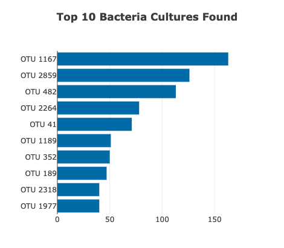
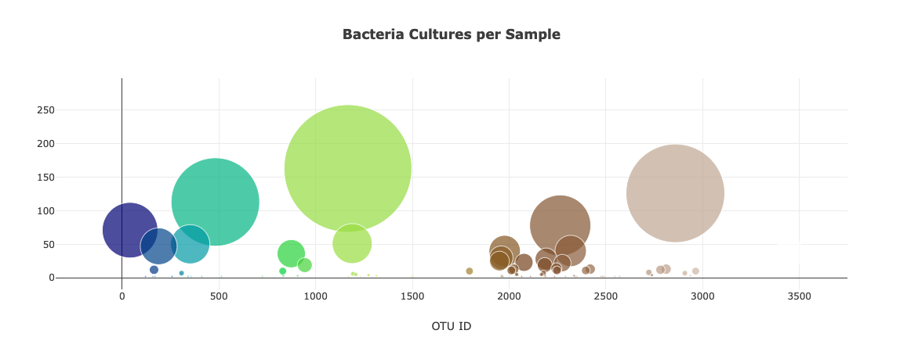
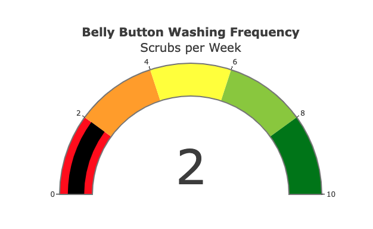

# Plotly Dashboard

## Overview:
Applying my understanding of JavaScript, HTML and CSS I created dynamic and engaging charts with Plotly. Using D3.json to fetch the external data from CSV and web APIs, I then parsed and manipulated the data in JavaScript. Using event handlers in JavaScript I was able to add interactivity to the data visualizations. The completed work was then deployed to a portfolio. 

---
### Resources:
* Source Code: [Challenge Script](charts.js)
* Source Data: [Samples](plotly/samples.json)
* Technology: [Plotly](https://plotly.com/python/), [D3.json](https://d3js.org/), [HTML](https://www.w3.org/standards/webdesign/htmlcss), [CSS](https://www.w3.org/standards/webdesign/htmlcss)

---
### Deliverables:
- [x] Deliverable 1: Create a Horizontal Bar Chart
- [x] Deliverable 2: Create a Bubble Chart
- [x] Deliverable 3: Create a Guage Chart
- [x] Deliverable 4: Customize the Dashboard

---
### Top 10 Bacterial Species:

Using my knowledge of JavaScript, Plotly, and D3.js, I created a horizontal bar chart to display the top 10 bacterial species (OTUs) when an individual’s ID is selected from the dropdown menu on the webpage. 

---
### Bacteria Cultures Per Sample:

Using my knowledge of JavaScript, Plotly, and D3.js, I created a bubble chart that displays the following when an individual’s ID is selected from the dropdown menu webpage:

- The otu_ids as the x-axis values.
- The sample_values as the y-axis values.
- The sample_values as the marker size.
- The otu_ids as the marker colors.
- The otu_labels as the hover-text values. 

---
### Washing Frequency :

Using my knowledge of JavaScript, Plotly, and D3.js, I create a gauge chart that displays the weekly washing frequency's value, as well as the value as a measure from 0-10 on the progress bar in the gauge chart when an individual ID is selected from the dropdown menu.

### Deployment 
Using my knowledge of HTML and Bootstrap I customized the webpage for my dashboard. There is an image in the jumbotron, additional information about the project as well as additional information about each graph. 

When the dashboard is first opened in a browser, ID 940’s data is displayed in the dashboard, and the three charts are working according to their requirements.
When a sample is selected, the dashboard updates to display the data in the panel and all three charts according to their requirements.

View the [deployed site](https://caseygomez.github.io/plotly_deployment/) to see the final project. 
